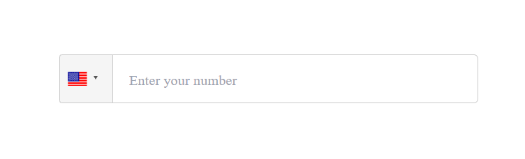
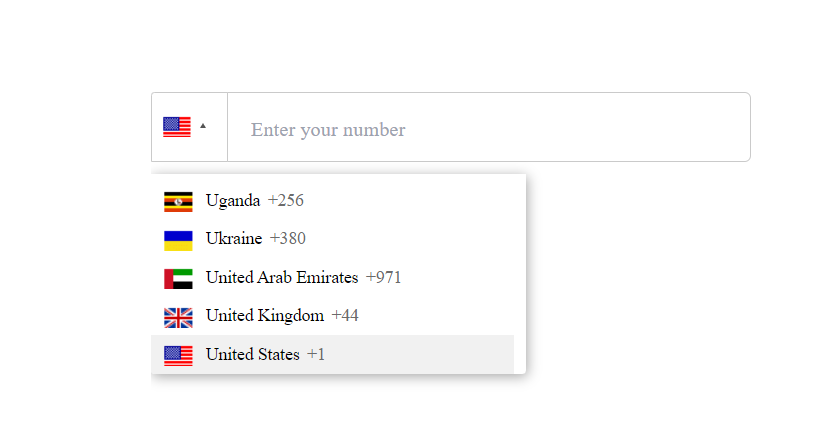
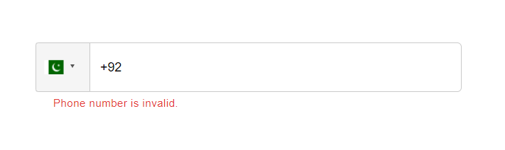
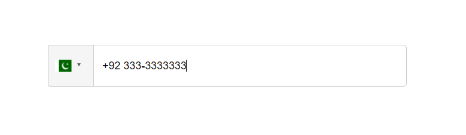
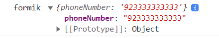

## Getting Started

Follow these instructions to run project locally.

### Prerequisites

Follow these commands to run project successfully.

-   npm

    ```sh
    npm install npm@latest -g
    ```
-   or if you want to add this into your project then install these

    ```sh
    npm install react-phone-number-input react-phone-input-2 formik
    ```
    

### Installation

1. Clone the repo

    ```sh
    git clone https://github.com/faiqfarooq/react-phone-input-2.git
    ```

2. Install packages in root directory

    ```sh
    npm install
    ```

3. All done :smile:

<!-- USAGE  -->

## Demo
`Firstly it looks like this.`



`When we click on the dropdown, it shows the list of countries.`



`we also applied the validation`



`when valid number is added, the error message will be gone.`



`The input number we get in this format. `




## Live Demo

[Click Here]([https://github.com/magnusmage/creata-launch-a-chain](https://react-phone-input-2.vercel.app/))

<!-- MARKDOWN LINKS & IMAGES -->
<!-- https://www.markdownguide.org/basic-syntax/#reference-style-links -->


